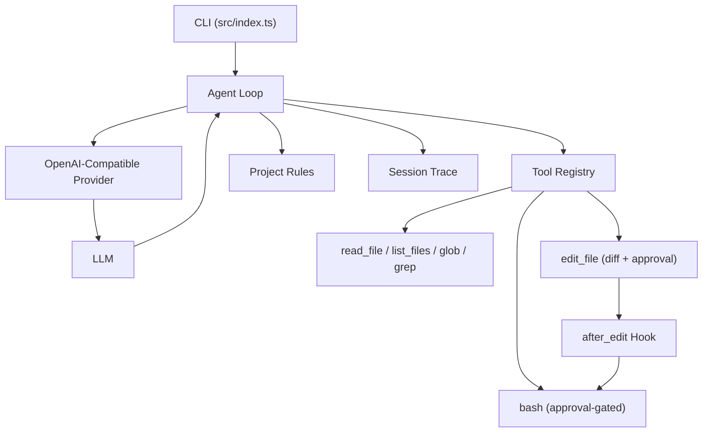

# NanoClaude

A lightweight TypeScript AI coding-agent framework with JSON tool calling, approval-gated edits, session traces, and a packaged CLI.

NanoClaude is a small, readable implementation of the core ideas behind coding agents: an LLM loop, tools, permissions, project rules, planning, verification hooks, and test coverage. It is intentionally educational rather than maximal.

## Why NanoClaude Exists

Modern coding agents can feel mysterious because tool calling, permission checks, edit previews, traces, and planning are often hidden inside large systems. NanoClaude keeps those pieces visible in a compact TypeScript codebase so it can be studied, extended, and demonstrated in interviews or portfolio reviews.

## Features

| Area | What NanoClaude Provides |
| --- | --- |
| LLM provider | OpenAI-compatible chat provider via `LLM_BASE_URL`, `LLM_API_KEY`, and `LLM_MODEL` |
| Agent protocol | Simple JSON responses for final answers, tool calls, and todo updates |
| Read-only tools | `read_file`, `list_files`, `glob`, `grep` |
| Command execution | Policy-controlled `bash` tool with allow/confirm/deny decisions, timeout, and capped output |
| Editing | Safe `edit_file` with unified diff preview and `y/N` approval |
| Plan Mode | In-memory todo list for complex tasks |
| Project rules | Loads `NANOCLAUDE.md`, `AGENTS.md`, or `CLAUDE.md` from the project root |
| Session traces | Redacted JSON traces under `.nanoclaude/sessions` |
| Hooks | `after_edit` suggests `npm run build` through the same approval-gated bash tool |
| CLI | `nanoclaude` binary with `--help`, `--version`, `--max-iterations`, `--no-hooks`, `--no-rules` |
| Tests | Vitest suite for non-LLM core logic |

## Quick Start

Install dependencies:

```bash
npm install
```

Create a local environment file:

```bash
cp .env.example .env
```

On Windows:

```powershell
copy .env.example .env
```

Configure an OpenAI-compatible provider in `.env`:

```bash
LLM_BASE_URL=https://api.openai.com/v1
LLM_API_KEY=your_api_key_here
LLM_MODEL=gpt-4.1-mini
```

Run in development:

```bash
npm run dev -- "Inspect this project and summarize its architecture"
```

Build and run the packaged CLI:

```bash
npm run build
node dist/index.js "Explain the available tools"
```

## CLI Usage

```bash
nanoclaude [options] "your task here"
```

Local development equivalent:

```bash
npm run dev -- [options] "your task here"
```

Options:

```text
--help                 Show help
--version              Show package version
--max-iterations <n>   Override the agent iteration limit
--no-hooks             Disable automatic hooks such as after_edit build checks
--no-rules             Skip NANOCLAUDE.md / AGENTS.md / CLAUDE.md loading
```

Examples:

```bash
node dist/index.js --help
node dist/index.js --version
node dist/index.js --no-rules "Explain this repository"
node dist/index.js --no-hooks "Edit README.md but do not auto-run build"
npm run dev -- --max-iterations 30 "Inspect the project and summarize it"
```

## Example Workflow

```bash
npm run dev -- "Make a tiny README improvement and verify the build"
```

Typical CLI output:

```text
[rules] loaded NANOCLAUDE.md
[todo] in_progress: Inspect README
[tool_call] read_file {"path":"README.md"}
[tool_result] success=true
[tool_call] edit_file {"path":"README.md","oldText":"<42 chars>","newText":"<58 chars>","reason":"Improve wording"}

[edit_file] Proposed changes for README.md:
--- README.md
+++ README.md
@@ -1,3 +1,3 @@
-old text
+new text

[edit_file] Apply this change? y
[tool_result] success=true
[hook] after_edit: npm run build
[bash] Run command in ...: npm run build y/N y
[hook_result] after_edit success=true
[session] saved .nanoclaude/sessions/<id>.json
```

See [docs/demo.md](docs/demo.md) for a fuller transcript.

## Safety Model

NanoClaude is designed to make side effects visible and reversible:

- Paths are resolved with real-path checks and must stay inside the project root.
- `read_file`, `list_files`, `glob`, and `grep` are read-only.
- `bash` uses a deterministic allow/confirm/deny policy. Confirm-class commands ask for approval, denied commands are rejected, and allowed verification commands can run without an extra prompt.
- `edit_file` shows a unified diff and asks for approval before writing.
- Tool outputs are capped before being sent back to the model or saved in traces.
- Session traces redact common secret-looking values and avoid storing `.env` contents.
- `after_edit` verification reuses the `bash` permission flow instead of bypassing approval.

## Architecture Overview



More detail: [docs/architecture.md](docs/architecture.md).

## Testing

Baseline verification for contributors:

```bash
npm install
npm run build
npm test
node dist/index.js --help
```

Run the build:

```bash
npm run build
```

Run tests:

```bash
npm test
```

Watch mode:

```bash
npm run test:watch
```

The test suite avoids real LLM calls and focuses on path safety, filesystem tools, edit validation, trace redaction, hook behavior, and CLI option parsing.

## Documentation

- [Architecture](docs/architecture.md)
- [Demo transcript](docs/demo.md)
- [Roadmap](docs/roadmap.md)
- [Example prompts](examples/README.md)

## Roadmap

Near-term ideas:

- Skills and reusable workflows
- Resumable sessions
- Config file for hooks and defaults
- Richer patch editing
- Sandbox or container execution mode
- Multi-provider benchmark harness

See [docs/roadmap.md](docs/roadmap.md) for the full milestone history and future plan.

## Resume-Friendly Summary

NanoClaude is a TypeScript implementation of a safe coding-agent runtime. It demonstrates LLM orchestration, JSON tool protocols, permission-gated command execution, diff-based editing, project rule injection, trace logging, hooks, CLI packaging, and automated tests in a compact codebase suitable for demos and technical interviews.
